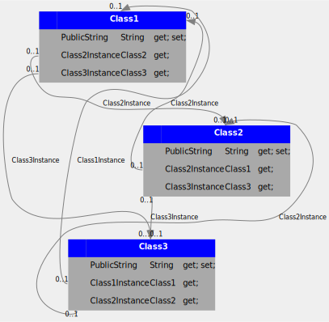

# .NET Class Diagram Generator

----

Generates a class diagram (SVG) using dot/graphviz after generating required dot files given the .NET assembly and optional namespace/regex filter.

Program first generates a dot file using the target assembly and type/namespace filter. It then uses graphviz to export the generated dot file to SVG. A sample diagram is below -

